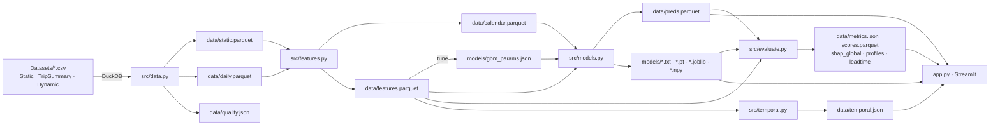

# DPF Health Copilot — Documentación técnica

Documento de referencia del repositorio: arquitectura, algoritmos, decisiones de diseño, protocolo de validación y
artefactos generados. Describe el estado del código en `main` (commit `122f89b` y posteriores). Los números citados
provienen de la última ejecución completa del pipeline (`data/quality.json`, `data/metrics.json`, `data/temporal.json`).

---

## Índice

1. [Problema y formulación](#1-problema-y-formulación)
2. [Arquitectura general](#2-arquitectura-general)
3. [Datos de entrada y semántica real de las columnas](#3-datos-de-entrada-y-semántica-real-de-las-columnas)
4. [`src/data.py` — ingesta, limpieza y agregación](#4-srcdatapy--ingesta-limpieza-y-agregación)
5. [`src/features.py` — ingeniería de variables y etiquetado](#5-srcfeaturespy--ingeniería-de-variables-y-etiquetado)
6. [`src/models.py` — ensamble de modelos](#6-srcmodelspy--ensamble-de-modelos)
7. [`src/evaluate.py` — evaluación, políticas de alerta y explicabilidad](#7-srcevaluatepy--evaluación-políticas-de-alerta-y-explicabilidad)
8. [`src/temporal.py` — validación temporal](#8-srctemporalpy--validación-temporal)
9. [`app.py` — dashboard](#9-apppy--dashboard)
10. [Garantías contra fuga de información y sobreajuste](#10-garantías-contra-fuga-de-información-y-sobreajuste)
11. [Resultados vigentes](#11-resultados-vigentes)
12. [Reproducibilidad, rendimiento y recursos](#12-reproducibilidad-rendimiento-y-recursos)
13. [Limitaciones conocidas y deuda técnica](#13-limitaciones-conocidas-y-deuda-técnica)
14. [Glosario](#14-glosario)

---

## 1. Problema y formulación

**Objetivo de negocio.** Anticipar, con la mayor antelación posible, los eventos de degradación de la eficiencia de
combustión asociados a la saturación del filtro de partículas diésel (DPF) por uso indebido: trayectos cortos,
regeneraciones que no llegan a completarse, uso urbano intensivo y arranques en frío. El resultado habilita mantenimiento
predictivo y recomendaciones de manejo al cliente.

**Formulación estadística.** Cada *vehículo-día activo* es un punto de predicción $(i, d)$. Para cada punto se estiman:

| Tarea | Variable objetivo | Modelo principal |
|---|---|---|
| Clasificación multi-horizonte | $y_H(i,d) = \mathbb{1}[\,0 < \text{tte}(i,d) \le H\,]$, $H \in \{30, 60, 90\}$ días | LightGBM, GRU, stacking |
| Tiempo al evento (supervivencia) | $\text{tte}(i,d)$ con censura a derecha | Random Survival Forest |
| Anomalía / salud | error de reconstrucción respecto de la flota sana | Autoencoder |

donde $\text{tte}(i,d)$ son los días hasta el próximo evento identificado del vehículo $i$ (indefinido si no hay evento
futuro).

**Métrica de negocio central.** Tasa de detección anticipada, es decir, la fracción de eventos con al menos una alerta en
los 180 días previos, frente a los *episodios de falsa alarma por vehículo-año* en vehículos sanos. Se compara siempre
contra la advertencia actual de la ECU.

---

## 2. Arquitectura general



Principios de diseño:

- **Pipeline por etapas con artefactos en disco** (Parquet/JSON): cada etapa se puede re-ejecutar de forma aislada y es
  inspeccionable.
- **Pocos archivos, sin abstracciones innecesarias**: 7 módulos en `src/` más la app. Cada módulo se ejecuta con
  `python -m src.<módulo>`.
- **Toda decisión de datos es trazable**: los conteos de descartes, anomalías y reconstrucciones se persisten en
  `data/quality.json` y se muestran en el dashboard.

| Archivo | Líneas | Responsabilidad |
|---|---|---|
| `src/config.py` | ~40 | Recursos por máquina (`config.local.json`): DuckDB, dispositivo, precisión mixta, parámetros de la red |
| `src/data.py` | ~215 | Ingesta DuckDB, limpieza, anclaje temporal, reconstrucción de regeneraciones, agregación diaria |
| `src/features.py` | ~170 | Calendario continuo, ventanas móviles, variables de estado/tendencia, etiquetas con censura, test anti-leakage |
| `src/models.py` | ~570 | Split, LightGBM (+ tuning), RSF, red híbrida con riesgo discreto, autoencoder, stacking, GBM monótono, experimentos de la red |
| `src/pretrain.py` | ~100 | Pre-entrenamiento auto-supervisado del codificador de la red (opcional) |
| `src/evaluate.py` | ~250 | Métricas con IC, políticas de alerta (fija/relativa), lead time vs ECU, SHAP, clustering |
| `src/temporal.py` | ~170 | Validación de despliegue simulado en una fecha de corte (LightGBM y red) |
| `app.py` | ~375 | Dashboard Streamlit (4 vistas) |

---

## 3. Datos de entrada y semántica real de las columnas

`Datasets/` contiene tres familias de tablas, cada una partida en fallados (`Failed`) y sanos (`NotFailed`), algunas con
versión `v2`:

| Tabla | Archivos usados | Granularidad | Filas |
|---|---|---|---|
| Static | `StaticInformation_FailedVins_v2_*.csv`, `StaticInformation_NotFailedVins_v2_*.csv` (+ v1 de fallados solo para excluir conflictos) | vehículo (o vehículo-evento) | ~1 070 |
| TripSummary | `TripSummary_Failed_SelectionVins_vehiclecode_v2 (2).csv`, `TripSummary_NotFailed_SelectionVins.csv` | viaje | 2.52 M |
| Dynamic | `DynamicInformation_Failed_SelectionVins_v2.csv`, `DynamicInformation_NotFailed_SelectionVins.csv` | evento de telemetría ECU | 9.9 M |

El dataset está **anonimizado y renombrado**; el esquema real difiere del anexo de la consigna (no hay GPS, presión de
neumáticos ni `DieselParticulateFilter*`). La interpretación que usa el código:

| Columna en el CSV | Interpretación | Evidencia |
|---|---|---|
| `AirFilterStart/End`, `Message` ("Air Filter Normal/Full/Over Limit/Overloaded/At Limit", "Cleaning Automatically", "Stopped Cleaning…") | Estado del **DPF** y de su regeneración | Vocabulario de estados idéntico al ciclo de un DPF |
| `AirRegenerationStart/End` (0–100, pasos de 5) | Carga de hollín del DPF [%] al inicio/fin del viaje | Distribución y correlación con `Acumulation` |
| `Acumulation` (Dynamic) | Carga de hollín instantánea [%] | Cae a ~0 exactamente cuando `Regenerations` = "Regeneration" |
| `Regenerations` | Bandera de regeneración completada | — |
| `DistanceBetweenRegenerations` | km desde la regeneración anterior | — |
| `IdentificationDaysSinceProduction` (v2) | Días desde producción hasta la identificación del evento | Etiqueta |
| `ProductionDay` | Días desde un origen $D_0$ desconocido, **distinto por archivo** | Ver §4.3 |

**Hallazgo sobre etiquetas v1.** En `StaticInformation_FailedVins.csv` (v1) se cumple
`IdentificationDate == daysUntilSale` en el 76 % de las filas: el campo es la fecha de venta, no la de falla. Por eso se
usan exclusivamente los archivos v2 para etiquetar. Los 297 vehículos fallados que están solo en v1 no se usan para
entrenar ni evaluar (no hay fecha de evento confiable); solo entran, sin etiqueta, en el pre-entrenamiento opcional de la
red (§6.4).

---

## 4. `src/data.py` — ingesta, limpieza y agregación

### 4.1 Motor y configuración

- **DuckDB** en memoria, con `memory_limit=4GB` y `threads=4` por defecto (ajustable en `config.local.json`, ver
  `src/config.py`). El límite es obligatorio: sin él, DuckDB puede tomar
  hasta ~80 % de la RAM y, con swap en zram, congelar una máquina de 16 GB. Esto ocurrió durante el desarrollo.
- Todos los CSV se leen con `all_varchar=true` y se castean explícitamente con `try_cast`. Un valor malformado se
  convierte en `NULL` en lugar de abortar la lectura.
- `num(col, lo, hi)` castea a `double` y convierte en `NULL` todo valor fuera del **rango físico plausible**. Así se
  eliminan sentinelas como −73 °C o −128 °C (temperatura ambiente) y −60 °C (motor).

| Variable | Rango aceptado |
|---|---|
| Nivel de combustible [%] | 0 – 105 (el sensor reporta hasta ~103.7) |
| Vida de aceite, hollín [%] | 0 – 100 |
| Temperaturas de motor/refrigerante [°C] | −40 – 130 |
| Temperatura ambiente [°C] | −40 – 55 |
| Distancia entre regeneraciones [km] | 0 – 20 000 |

### 4.2 Tabla estática y resolución de conflictos

- `sf` (fallados v2): `DISTINCT` sobre (vehículo, `idp`, …); un vehículo puede tener **varios eventos**
  (19 vehículos).
- `sn` (sanos v2): una fila por vehículo (`any_value`), porque el archivo trae duplicados.
- **Conflictos de etiqueta**: se eliminan de `sn` los vehículos que aparecen en cualquier lista de fallados (v1 o v2).
  Son 27 vehículos.
- Resultado: **277 vehículos con evento y 715 sanos**.

### 4.3 Anclaje temporal (reconstrucción del calendario)

`ProductionDay` es relativo a un origen $D_0$ desconocido, y el evento se expresa en días desde producción. Para ubicar
los eventos en el calendario de la telemetría:

$$
D_0^{(c)} = \operatorname{mediana}_{i \in c}\left(\text{primer\_viaje}_i - \text{ProductionDay}_i\right)
$$

por **cohorte** $c \in \{\text{fallados}, \text{sanos}\}$, porque cada archivo usa un origen distinto
($D_0 \approx$ día epoch 19 569.7 y 20 107.8). La hipótesis de que el primer viaje ocurre en planta se valida con la
dispersión: el rango p5–p95 del residuo es **0.65 días** en ambas cohortes. El script aborta con `assert` si supera
2 días. Luego:

$$
\text{prod}_i = D_0^{(c)} + \text{ProductionDay}_i, \qquad \text{evento}_{i,k} = \text{prod}_i + \text{idp}_{i,k}
$$

La tabla `static` guarda `events` como **lista ordenada de fechas** por vehículo (vacía para sanos).

### 4.4 Limpieza de viajes

Reglas de exclusión, cada una contada por separado en `quality.json`:

| Regla | Condición SQL | Filas |
|---|---|---|
| Timestamp inválido | `ts0 is null or ts1 is null or ts1 < ts0` | 0 |
| Duración > 24 h | `epoch(ts1-ts0) > 86400` | 224 |
| Odómetro decreciente | `o1 < o0 or o0 is null` | 274 |
| Viaje > 1 500 km | `o1 - o0 > 1500` | 5 |
| Velocidad > 200 km/h | `km/h > 200 and km > 2` | 288 |
| **Total inválidos** (unión) | | 786 |
| Duplicados | mismo `(v, ts0)`: se conserva uno | 40 760 |

Entre duplicados se conserva la fila con `row_number()` sobre un orden total de las columnas del viaje, y las lecturas
de hollín con el mismo timestamp se desempatan por valor: así el resultado no depende de la cantidad de hilos de DuckDB
(antes variaba ~0.1 % de los días entre corridas). Quedan **2 476 875 viajes**. La hora local se aproxima con un desfase fijo UTC−4 (flota LatAm, UTC−3…−5), usado para el
día de agregación y para las variables nocturnas.

### 4.5 Reconstrucción de regeneraciones desde la señal de hollín

**Problema detectado.** La bandera `Regenerations` deja de reportarse para **toda la flota** desde el
**2026-05-26**, aunque siguen llegando 3.16 M de mensajes ECU. Además, venía degradándose desde marzo: 1.5–1.9 eventos
por 1 000 km contra ~2.5 reales. Usada tal cual, provocaba un artefacto grave: el modelo interpretaba "80 días sin
regenerar" y el riesgo medio de los sanos subía de 0.04 a 0.41.

**Solución.** `Acumulation` (hollín instantáneo) sigue llegando sin interrupciones, y una regeneración real se manifiesta
como una caída abrupta de hollín. Algoritmo, implementado con funciones de ventana SQL:

1. `soot_drop = lag(acc) − acc` sobre las lecturas ordenadas por vehículo y timestamp.
2. **Regeneración completa**: `soot_drop ≥ 20` puntos. Las ocurrencias a menos de 6 h de la anterior se fusionan en un
   solo episodio (tabla `rg`).
3. **Distancia entre regeneraciones**: `odo − lag(odo)` entre episodios consecutivos, válida en [0, 20 000] km.
4. **Regeneración parcial**: `10 ≤ soot_drop < 20` (tabla `rp`), indicio de regeneraciones incompletas.

**Validación** contra la bandera, antes del corte (emparejamiento por vehículo con tolerancia de ±12 h):

| Regla candidata | Recall | Precisión |
|---|---|---|
| hollín previo ≥ 30 y actual ≤ 10 | 0.64 | 0.88 |
| **caída ≥ 20** (elegida) | **0.91** | **0.81** |
| caída ≥ 15 | 0.94 | 0.80 |

A nivel vehículo-mes la correlación es **0.88**, y la tasa se mantiene estable antes y después del corte
(≈2.4–3.1 por 1 000 km). Resultado: 88 407 episodios reconstruidos y el período completo utilizable, sin corte
administrativo. La bandera original solo se usa para reportar el corte en `quality.json`.

### 4.6 Agregación diaria

Dos agregaciones por (vehículo, día local), unidas con `FULL JOIN`, dan **284 678 vehículo-días**.

**Desde viajes (`td`):**

| Variable | Definición |
|---|---|
| `n_trips`, `km`, `mins` | conteo y sumas del día |
| `sh_short5`, `sh_short10`, `sh_micro` | fracción de viajes < 5, < 10 y < 2 km |
| `speed` | $\sum km / \sum horas$ |
| `sh_urban` | fracción de viajes con velocidad media < 25 km/h |
| `sh_never_warm` | fracción de viajes con temperatura máxima de motor < 70 °C |
| `sh_cold_start` | fracción de viajes con refrigerante inicial < 30 °C |
| `etmax`, `etavg`, `cool_rise` | temperaturas medias y calentamiento del refrigerante |
| `fuel_used`, `fuel_per100` | $\sum \max(f_0-f_1,0)$ y su valor por 100 km (en % de tanque) |
| `soot_max`, `soot_mean`, `soot_delta`, `soot_per_km` | carga de hollín por viaje |
| `sh_trip_end_in_regen` | fracción de viajes que terminan con regeneración en curso (**regeneración interrumpida**) |
| `regen_completed_in_trip` | viajes que empiezan limpiando y terminan fuera de ese estado |
| `sh_end_full`, `sh_end_over` | fracción de viajes que terminan con DPF lleno / sobre el límite |
| `oil_min`, `oil_drop` | vida de aceite mínima y caída |
| `air`, `air_min` | temperatura ambiente |
| `sh_night`, `sh_idle` | viajes nocturnos (22–05 h) y ralentí (> 5 min y < 1 km) |

**Desde telemetría (`dd`):**

| Variable | Definición |
|---|---|
| `n_msgs` | mensajes del día |
| `acc_mean`, `acc_max` | hollín instantáneo |
| `sh_full`, `sh_over`, `sh_overloaded`, `sh_regen_msg` | fracción de mensajes por estado del DPF |
| `n_regen_stopped`, `n_manual_regen` | regeneraciones detenidas / manuales (por mensaje) |
| `n_regen`, `dbr_min`, `dbr_mean` | **regeneraciones reconstruidas** y distancia entre ellas |
| `n_regen_partial` | caídas parciales de hollín |

### 4.7 Salidas

- `data/static.parquet`: vehículo, `failed`, `events` (lista de fechas), `prod`, `Engine`, `ModelSeries`, `country`,
  `city`.
- `data/daily.parquet`: la tabla vehículo-día.
- `data/quality.json`: todos los conteos anteriores más la tasa de nulos por variable de viaje.
- `data/daily_v1.parquet` (`python -m src.data v1`): la misma agregación diaria para los 297 fallados que solo están en
  los archivos v1 (sin fecha de falla confiable). Solo la usa el pre-entrenamiento opcional (§6.4); no tiene etiquetas.

---

## 5. `src/features.py` — ingeniería de variables y etiquetado

### 5.1 Calendario continuo

`calendar()` reindexa cada vehículo a **días calendario consecutivos**, desde su primer hasta su último día con datos.
Los días sin uso quedan con `active = False`, las sumas (`SUMS`) en 0 y el resto en `NaN`. Esto hace que las ventanas
móviles sean en días calendario y no en "últimos N registros".

### 5.2 Ventanas móviles ($w \in \{7, 30, 90\}$ días, solo pasado)

Sobre el calendario se aplica `groupby(v).rolling(w, min_periods=1)`. La ventana incluye el día actual y nunca días
futuros.

| Familia | Fórmula | Columnas |
|---|---|---|
| Intensidad | $\frac{1}{w}\sum_{t\in W} x_t$ | `w{w}_n_trips`, `w{w}_km`, `w{w}_n_regen`, … |
| Proporciones por viaje | $\frac{\sum_{t\in W} sh_t \cdot n\_trips_t}{\sum_{t\in W} n\_trips_t}$ (ponderadas por viajes) | `w{w}_sh_short5`, `w{w}_sh_urban`, … |
| Proporciones por mensaje | ídem, ponderado por `n_msgs` | `w{w}_acc_mean`, `w{w}_sh_over`, … |
| Extremos | máx/mín de la ventana | `w{w}_soot_max`, `w{w}_dbr_min`, `w{w}_oil_min`, … |
| Derivadas | `speed` = km/h; `fuel_per100`; `km_per_regen` = km / regeneraciones; `km_per_trip`; `regen_stop_ratio` = detenidas / (regeneraciones + 1); `regen_partial_ratio` = parciales / (completas + parciales); `soot_per_km`; `active_share` | |

La ponderación por viajes evita que un día con un solo viaje pese lo mismo que uno con veinte.

### 5.3 Variables de tendencia, estado e historia propia

- **Tendencias** (aceleración de la degradación): `trend_x = w7_x − w90_x` y `trend30_x = w30_x − w90_x`, para hollín,
  mensajes sobre el límite, km por regeneración, consumo, viajes cortos, etc.
- **Estado del ciclo de regeneración**: `km_since_regen` y `days_since_regen`, acumulados que se reinician con cada
  regeneración (`cumsum` agrupado por el contador de regeneraciones). Valen `NaN` antes de la primera.
- **Desvío respecto de la propia historia** (z-score autorreferencial):
  $$\text{selfz}(x)_d = \frac{x_d - \mu_{\le d-30}}{\sigma_{\le d-30}}$$
  con media y desvío *expanding* desplazados 30 días, para que la línea base no incluya el período reciente. Se aplica
  a hollín, mensajes sobre el límite, km por regeneración, consumo y viajes cortos.
- **Tasas de vida útil**: `life_sh_short5`, `life_sh_over`, `life_regen_stopped_per_1000km`, `life_km_per_regen`. Son
  cocientes de acumulados, por lo que **no crecen con la edad**. Los acumulados crudos se descartaron por ser
  *proxies* de la edad.

### 5.4 Variables excluidas (`NON_FEATURES`)

`v`, `day`, `failed`, `tte`, `gap_to_end`, `age_days`, `usable`, `y*` y `m*` nunca entran a un modelo. El motivo
principal es un **sesgo de cohorte**: los vehículos con evento fueron producidos desde 2023 y los sanos desde 2025. La
edad, el odómetro o la fecha permitirían al modelo aprender "auto viejo ⇒ falla" en vez de la física del DPF.
Sí se incluyen `Engine`, `ModelSeries` y `country` como categóricas nativas de LightGBM.

Total: **170 features** sobre **282 378 vehículo-días activos** (los días sin uso no son puntos de predicción).

### 5.5 Etiquetas con censura

Para cada vehículo con eventos ordenados $e_1 < e_2 < \dots$:

- $\text{tte}(d) = e_k - d$, con $e_k$ el primer evento $\ge d$ (vía `np.searchsorted`); `NaN` si no hay evento futuro.
- $\text{since}(d)$ = días desde el evento anterior.
- **Fila utilizable**: $\text{tte} \ne 0$ (el día del evento se excluye) **y** $\text{since} > 14$ (se excluyen
  14 días de transición post-service). Tras cada service el "reloj" se reinicia, lo que permite modelar vehículos con
  varios eventos.
- **Positivo**: $y_H = \mathbb{1}[\text{tte} \le H]$.
- **Máscara de censura**: $m_H = \text{usable} \wedge (y_H = 1 \vee \text{gap\_to\_end} \ge H)$. Un negativo solo es
  válido si se observan los $H$ días siguientes; si no, la etiqueta es desconocida y la fila no participa en ese
  horizonte.

| Horizonte | Filas válidas | Positivos | Tasa |
|---|---|---|---|
| 30 d | 256 426 | 5 938 | 2.3 % |
| 60 d | 235 403 | 11 938 | 5.1 % |
| 90 d | 215 449 | 18 158 | 8.4 % |

### 5.6 Test anti-leakage automático

Al ejecutar `python -m src.features` se recalculan las features de un vehículo con su historia **truncada a la mitad** y
se verifica con `pd.testing.assert_frame_equal` que las filas previas al corte sean idénticas a las calculadas con la
historia completa. Si alguna feature dependiera del futuro, el test falla.

### 5.7 Salidas

- `data/calendar.parquet`: vehículo × día calendario con las variables diarias crudas. Es la entrada de la GRU.
- `data/features.parquet`: vehículo-día activo × (features + etiquetas + máscaras).

---

## 6. `src/models.py` — ensamble de modelos

### 6.1 Protocolo de partición

```
992 vehículos
├── Holdout (20 %, estratificado por failed)  → 198 vehículos, fold = −1: NUNCA se usan para entrenar ni para decidir
└── Train (80 %) → 794 vehículos
    └── StratifiedGroupKFold(K=5, agrupado por vehículo) → fold 0..4
```

- **Unidad de partición: el vehículo**, no la fila. Los días consecutivos de un mismo vehículo son casi idénticos; un
  split por filas filtraría identidad.
- Para cada fold $k$ se entrena con los folds $\ne k$ y se predice:
  - el fold $k$ → **predicciones OOF** (*out-of-fold*), que usan el stacking y la selección de umbrales;
  - el holdout → promedio de los 5 modelos (peso $1/K$).
- Semilla fija `SEED = 0` en NumPy, scikit-learn, LightGBM y PyTorch.

### 6.2 LightGBM (componente principal)

- Un clasificador binario por horizonte, entrenado con las filas $m_H$.
- Hiperparámetros efectivos (`models/gbm_params.json`):
  `n_estimators=600, learning_rate=0.03, num_leaves=15, min_child_samples=1000, subsample=0.8 (bagging por árbol),
  colsample_bytree=0.5, reg_lambda=10`.
- **Búsqueda de hiperparámetros** (`python -m src.models tune`): grilla explícita de 8 configuraciones con
  regularización creciente (hojas, mínimo por hoja, L2, submuestreo de columnas, *extra trees*, tasa de aprendizaje).
  Se evalúa con OOF de los 5 folds de train a $H = 90$; **el holdout no interviene**. Se elige la configuración con
  mejor suma de *rankings* de AUC y AP OOF. Resultado: todas quedan en AUC OOF 0.794–0.803, así que el desempeño es
  poco sensible a la regularización. El AUC en entrenamiento se mantiene en ~0.98–0.99 incluso con 7 hojas: es
  memorización de la identidad de vehículos ya vistos, que no se traslada a la validación.

### 6.3 Random Survival Forest (tiempo al evento)

- `sksurv.ensemble.RandomSurvivalForest(n_estimators=150, min_samples_leaf=40, max_features="sqrt")`.
- **Objetivo**: evento = `tte` definido; tiempo = `tte` si hay evento, si no `gap_to_end` (censura a derecha).
- **Landmarking**: se toma una observación cada 14 días activos por vehículo, para evitar miles de filas casi
  duplicadas y reducir costo.
- **Features**: las 30 numéricas de mayor *gain* del LightGBM a 90 d del mismo fold, con imputación por mediana de
  train.
- **Salidas**: $P(\text{evento} \le t) = 1 - S(t)$ para $t \in \{30, 60, 90, 180\}$, y
  $\text{RUL} = \min\{t : S(t) < 0.5\}$ (si la curva nunca cruza 0.5 se reporta el máximo tiempo observado). La
  predicción se hace por lotes de 20 000 filas para acotar memoria.

### 6.4 Red neuronal híbrida con cabeza de riesgo discreto

La arquitectura se define en `ARCH` (`src/models.py`) y se eligió comparando variantes con AUC/AP OOF
(`python -m src.models nn`); el holdout no intervino. Valor vigente: `seq=180, tab=True, head="hazard", pre=False`.

**Entradas.**

- **Secuencia**: los últimos **180 días calendario** del vehículo, terminando en el día de predicción, con 38 variables
  diarias (`SUMS + TRIP_W + MSG_W + MAXS + MINS`) más `active`. Sumas en $\log(1+x)$; estandarización con las filas de
  entrenamiento del fold; `NaN` → 0; recorte a ±6. La clase `Seq` no materializa las ventanas: indexa una matriz única
  ya subida al dispositivo (GPU o CPU), y los días previos al inicio del vehículo apuntan a una fila de *padding*
  enmascarada.
- **Tabulares** (`tab`): las 170 features de ingeniería del día de predicción, estandarizadas con el train, `NaN` → 0
  más una máscara de faltantes (340 entradas), y embeddings de dimensión 4 de `Engine`, `ModelSeries` y `country`.

**Arquitectura (`SeqNet`):**

```
x ∈ R^{B×180×39} → Linear(39→64) + GELU → GRU(64, 1 capa) → h_1..h_180
atención: a_t = softmax_t( w·h_t ), enmascarando padding          ctx = Σ a_t h_t
lateral:  [features ‖ máscara ‖ emb(Engine) ‖ emb(ModelSeries) ‖ emb(country)] → Linear(→64) + GELU → s
cabeza:   [ctx ‖ h_180 ‖ s] → Dropout(0.3) → Linear(192→64) + GELU → Linear(64→26)   → logits de hazard semanal
```

**Cabeza de riesgo discreto.** Hazard $h_j = \sigma(z_j)$ para las semanas $j = 0..25$. Con $k$ = semana del evento
(si $\text{tte} \le 182$) o cantidad de semanas completas observadas sin evento (censura, con `gap_to_end`), la pérdida
es la verosimilitud en tiempo discreto:
$$-\log L = -\Big[\sum_{j<k} \log(1-h_j) + e\,\log h_k\Big], \qquad e = 1 \text{ si hubo evento dentro de 26 semanas}$$
La supervivencia $S$ en los bordes de semana es $\exp$ de la suma acumulada de $\log(1-h_j)$; $P(T \le H)$ interpola
$\log S$ dentro de la semana, así que las probabilidades a 30/60/90 d son **monótonas por construcción**. El RUL es el
día en que $S$ cruza 0.5 (o ≥ 182 si no cruza) y se guarda en `gru_rul`. Las columnas `gru30/60/90` se mantienen para el
stacking y el dashboard. (La cabeza anterior, `head="bce"`, sigue disponible: una BCE por horizonte enmascarada con
$m_H$ y peso $\sqrt{\min((1-\bar y_h)/\bar y_h, 20)}$.)

**Entrenamiento.**

- Validación interna: ~15 % de los **vehículos** del train del fold, estratificado por fallado; también define el
  escalado. **Parada temprana** por AP media de los 3 horizontes (paciencia 3, hasta 40 épocas) restaurando los mejores
  pesos.
- **Ensamble de 5 semillas**; la predicción es la media y el desvío entre semillas queda como incertidumbre por fila
  (`gru{30,60,90}_std`).
- Muestreo por época: todos los positivos más 15 % de negativos. AdamW (lr 2e-3, *weight decay* 1e-3), batch 512,
  *gradient clipping* 1.0, precisión mixta fp16 en GPU (`GradScaler`); la atención se calcula en fp32.
- Dispositivo, precisión mixta, semillas, épocas y batch salen de `config.local.json` (`src/config.py`); corre igual en
  CPU. Con una Radeon RX 6650 XT (ROCm) una época tarda ~5 s y el pipeline completo ~15 min.
- Los pesos de atención (media de las semillas) se guardan en `models/gru_attention.npy` para el dashboard.

**Pre-entrenamiento auto-supervisado (opcional, `pre=True`, no adoptado).** `src/pretrain.py` entrena la capa de entrada
y la GRU con dos objetivos: reconstruir días enmascarados (15–30 % de la ventana; como la GRU es causal, cada día se
reconstruye desde el pasado) y predecir las sumas de la semana siguiente de km, regeneraciones y hollín. Datos: el
calendario de los vehículos de entrenamiento **de ese fold** más los 297 fallados exclusivos de v1, cortado en el último
día de entrenamiento; nunca ve el holdout, el fold de validación ni días posteriores a $T$ en la validación temporal. Se
corre dentro de `fit_gru` y los pesos se copian a cada semilla antes del ajuste fino.

**Resultados de la comparación** (OOF, antes de regenerar los datos; detalle en el README, sección "Red neuronal"):

| Variante | AUC OOF 30 / 60 / 90 d |
|---|---|
| GRU original (60 d, 6 épocas, 1 semilla) | – / – / 0.713 |
| + parada temprana, 5 semillas | 0.796 / 0.767 / 0.756 |
| 180 días | 0.795 / 0.779 / 0.775 |
| + tabulares (60 d / 180 d) | 0.815 / 0.787 / 0.777 · 0.813 / 0.789 / 0.781 |
| **+ riesgo discreto, 180 d** | **0.827 / 0.793 / 0.778** |
| ídem 365 d | 0.821 / 0.792 / 0.780 |
| ídem + pre-entrenamiento | 0.837 / 0.809 / 0.795 |

El pre-entrenamiento mejora fuera del ruido en OOF (bootstrap de a pares por vehículo, IC95 de ΔAUC excluye 0) pero no
en la validación temporal (ΔAUC de −0.002 a +0.015, IC95 incluye 0 en 5 de 6 casos); por el criterio fijado de antemano
(mejorar en OOF **y** en temporal) no se adopta.

**Desempeño vigente** (holdout): AUC 0.823 / 0.798 / 0.782, al nivel del LightGBM (0.820 / 0.799 / 0.780).

### 6.5 Autoencoder (Health Index)

- MLP simétrico `n → 64 → 12 → 64 → n` con GELU, sobre todas las features numéricas.
- **Entrenado solo con vehículo-días de vehículos sanos** del fold de train.
- Escalado robusto: $(x - \text{mediana}) / \text{IQR}$, recorte a ±8. Pérdida Smooth-L1, AdamW, 15 épocas, batch 1024.
- Score: `ae_err` = error de reconstrucción medio por fila.
- **Health Index** $= 100 \cdot \big(1 - \text{rango percentil de } \text{ae\_err} \text{ respecto de los días sanos OOF}\big)$,
  en escala 0–100 (100 = indistinguible de la flota sana).

### 6.6 Stacking

Por horizonte, una regresión logística ($C = 1$) sobre
$[\text{logit}(p_{gbm}), \text{logit}(p_{gru}), \text{logit}(p_{rsf,H}), \log(\text{ae\_err})]$, entrenada **solo con
predicciones OOF**. Coeficientes vigentes (gbm, gru, rsf, ae):

| H | GBM | Red | RSF | AE |
|---|---|---|---|---|
| 30 | 0.465 | 0.410 | 0.160 | 0.166 |
| 60 | 0.499 | 0.316 | 0.081 | 0.175 |
| 90 | 0.564 | 0.229 | 0.055 | 0.158 |

Con la red anterior los pesos de la GRU eran ~0.05. Aun así, el stack mejora poco: ΔAUC OOF de a pares +0.003 / +0.002 /
+0.000 (dentro del ruido); la red aprende casi lo mismo que el LightGBM y desplaza sobre todo al RSF.

El stacking produce probabilidades calibradas (Brier 0.064 a 90 d) y es el *score* que se usa en las alertas
(`stack90`).

### 6.7 Modelos finales y modelo *what-if*

- Tras el CV se reentrenan LightGBM (3 horizontes) y la red (5 semillas) con **todo el train**. Se usan para SHAP, atención y el
  dashboard; las métricas se reportan siempre con OOF/holdout.
- **GBM monótono para el simulador** (`models/gbm90_whatif.txt`). El LightGBM libre no es causal: en esta muestra, el
  perfil "ruta" aparece más entre los fallados por el diseño muestral, y un *what-if* con ese modelo daba recomendaciones
  absurdas (más viajes de ruta ⇒ más riesgo). Se entrena una variante con `monotone_constraints` (método `advanced`)
  sobre 36 features:
  - **crecientes**: viajes cortos, micro y urbanos, nunca en temperatura, arranques en frío, ralentí, viajes que
    terminan en regeneración, ratio de regeneraciones detenidas, km y días desde la última regeneración;
  - **decrecientes**: km por viaje y velocidad.

  Costo: AUC holdout 0.771 frente a 0.780 del libre. Garantía: ninguna mejora de hábito puede aumentar el riesgo
  simulado.

### 6.8 Salidas

`data/preds.parquet` (una fila por vehículo-día: fold, etiquetas, `gbm*`, `gru*`, `gru*_std`, `gru_rul`, `rsf*`, `rul`,
`ae_err`, `stack*`, `health`) y `models/` (`gbm{30,60,90}.txt`, `gbm90_whatif.txt`, `gbm_params.json`, `stack*.joblib`,
`gru.pt` = `{"arch", "nets": [5 state_dicts]}`, `gru_scaler.joblib`, `gru_attention.npy`, `encoder.pt` si `pre=True`).
`python -m src.models nn <tag> k=v…` entrena solo la red y escribe `data/nn_<tag>.parquet` y `data/nn_results.jsonl`.

---

## 7. `src/evaluate.py` — evaluación, políticas de alerta y explicabilidad

### 7.1 Discriminación

Por modelo y horizonte, sobre filas $m_H$ del holdout:

- **AUC-ROC y AP** (*average precision*, preferible con prevalencia de 2–8 %).
- **IC 95 % por bootstrap agrupado por vehículo** (`cluster_ci`, 300 remuestreos): se remuestrean vehículos completos
  con reemplazo, porque las filas de un vehículo están correlacionadas y un bootstrap por filas subestimaría la
  varianza.
- **AUC dentro de fallados**: la misma métrica restringida a vehículos con evento. Mide si el modelo sabe *cuándo* se
  acerca el evento, sin poder apoyarse en diferencias entre cohortes.
- **AUC OOF** en train (comparación con el holdout para detectar sobreajuste a la validación cruzada).
- **Brier score** y curva de calibración por deciles de `stack90`.
- **C-index de Harrell** del RUL del RSF (`sksurv.metrics.concordance_index_censored`).

### 7.2 Política de alerta y métrica de anticipación

1. **Suavizado**: `score_s` = media móvil de 7 días (calendario) de `stack90` por vehículo.
2. **Detección** (`leadtime`): para cada evento de un vehículo fallado se toma la ventana $[e - 180, e)$ (se requieren al
   menos 5 días con datos). El evento se considera **detectado** si hay al menos un día en alarma, y la **anticipación**
   es $e - $ primer día en alarma, en días y en **km** (km acumulados del vehículo hasta el evento menos los acumulados
   hasta la primera alarma; los km diarios salen de los viajes, `calendar.parquet`).
3. **Falsas alarmas**: sobre vehículos sanos, un **episodio** es un día en alarma sin otra alarma en los 30 días previos
   (*cooldown*: no se re-notifica). Se reporta como episodios por vehículo-año, sumando el tiempo observado de cada
   vehículo.
4. **Línea base ECU**: alarma si hubo algún mensaje "Over Limit / Overloaded / At Limit" en los últimos 7 días
   (`w7_sh_over > 0`). Representa el aviso reactivo actual.

### 7.3 Umbral fijo vs umbral relativo a la flota

- **Umbral fijo**: `score_s ≥ τ`, con τ = cuantil $1-\alpha$ de `score_s` en días sanos OOF, para
  $\alpha \in \{1, 2, 5, 10, 15, 20, 30\}\,\%$.
- **Umbral relativo** (`fleet_threshold`): para cada día $d$, el umbral es el cuantil $1 - X$ de `score_s` de **toda la
  flota** en los días $(d - 30, d]$. Si la ventana tiene menos de 200 valores, se usa la historia expandida. Es causal
  (solo pasado), no usa etiquetas y es computable en producción. Fija el volumen de alertas por diseño aunque la
  distribución de riesgo de la flota se desplace (por ejemplo, por envejecimiento). También se calcula un umbral
  "medio" con $2X$ para el estado intermedio del dashboard.
- **Selección del punto de operación** (`pick_operating`): **con OOF, nunca con el holdout**, se elige la mayor
  sensibilidad cuya tasa de falsas alarmas no supere la de la ECU. Vigente: umbral fijo 10 % de días sanos; relativo
  top 20 % de la flota.
- **IC 95 % de la detección** por bootstrap sobre eventos (1 000 remuestreos).

### 7.4 Explicabilidad

- **SHAP global**: `shap.TreeExplainer` sobre `gbm90.txt` con 5 000 filas del holdout; $|SHAP|$ medio por feature,
  agregado en grupos de hipótesis física (`GROUPS`: Hollín/DPF, Regeneraciones, Patrón de uso, Térmico, Consumo, Aceite,
  Clima, Vehículo/mercado) mediante `group_of`.
- **SHAP local** (en el dashboard): *waterfall* de las 12 contribuciones de mayor magnitud para el vehículo-día elegido.
- **Atención de la red**: qué días de los últimos 180 pesaron en la predicción.

### 7.5 Perfiles de conductor

K-Means ($k=4$, `n_init=20`) sobre la mediana por vehículo, en días previos al primer evento, de 9 variables de uso a
90 d estandarizadas. Los clusters se nombran de forma greedy por centroides (mayor fracción de viajes cortos ⇒ "Urbano
de viajes cortos"; mayor km por viaje ⇒ "Ruta"; mayor km/día ⇒ "Uso intensivo"; resto ⇒ "Mixto"). Las tasas de falla
por perfil son **descriptivas**: están afectadas por el diseño muestral de las listas de fallados y sanos.

### 7.6 Salidas

`data/metrics.json` (todo lo anterior), `data/scores.parquet` (`score_s`, `ecu_warning`, `thr_rel`, `thr_rel_med` por
vehículo-día), `data/leadtime.parquet`, `data/shap_global.parquet`, `data/profiles.parquet`.

---

## 8. `src/temporal.py` — validación temporal

Simula **poner el sistema en producción el $T$ = 2026-01-01**. Complementa el holdout por vehículo, que comparte
período y estacionalidad con el entrenamiento y por eso es optimista.

- **Etiquetas conocidas en $T$** (`known_at`): una fila de entrenamiento es válida si $d + H < T$, o si su evento ya
  ocurrió antes de $T$.
- **Evaluación**: filas con $d \ge T$.
- **Escenarios**:
  - *vehículos nuevos*: se entrena con los vehículos de train y se evalúa en los del holdout (separación por vehículo y
    por tiempo);
  - *misma flota*: se entrena y evalúa con todos los vehículos (la flota ya monitoreada, en el futuro).
- **Calibración de umbrales sin mirar el futuro**: un modelo entrenado con lo conocido en $T - 90$ puntúa el período
  $[T-90, T)$. Ahí se eligen los puntos de operación fijo y relativo con el mismo criterio de §7.3. En ese período, se
  considera "sano" a todo vehículo **sin evento conocido en $T$**. (Una versión anterior usaba la etiqueta final
  sano/fallado, que filtra información del futuro e inflaba la aparente descalibración del umbral fijo.)
- Se evalúa el **LightGBM** (componente dominante del ensamble), con IC por vehículo.
- `python -m src.temporal nn <tag> k=v…` evalúa la **red** en los mismos dos escenarios (AUC con IC): entrena con las
  máscaras de `known_at`, oculta los eventos posteriores a $T$ y recorta la censura a $T$ (para la cabeza de riesgo); el
  pre-entrenamiento, si está activo, tampoco ve días $\ge T$. Guarda las predicciones en
  `data/nn_temporal_<tag>_<escenario>.parquet` para comparar variantes de a pares. Resultado vigente (AUC 30 / 60 / 90 d):
  vehículos nuevos 0.697 / 0.667 / 0.602, misma flota 0.718 / 0.694 / 0.660; el LightGBM da 0.719 / 0.666 / 0.637 y
  0.724 / 0.693 / 0.658.

---

## 9. `app.py` — dashboard

Streamlit con Plotly. Los datos se cargan con `st.cache_data` y los modelos con `st.cache_resource`. Paleta con slots
categóricos fijos (azul = modelo, naranja = ECU, aqua = umbral relativo / GRU), colores de estado reservados y siempre
acompañados de ícono y texto.

| Vista | Contenido |
|---|---|
| **Flota** | KPIs (vehículos, en alerta, anticipación mediana, detección); ranking por riesgo con Health Index, RUL, perfil y país; tasa de falla por perfil; estados por país. El estado usa la **política relativa**: Alto si `score_s ≥ thr_rel`, Medio si `≥ thr_rel_med`. |
| **Vehículo** | Riesgo en el tiempo con el umbral de flota dinámico, advertencias ECU y eventos; *small multiples* de hollín, km entre regeneraciones, viajes cortos y consumo (un eje por gráfico); SHAP local; P(evento ≤ t) del RSF; atención de la GRU; recomendaciones prescriptivas; simulador *what-if*. |
| **Modelo y negocio** | Tabla de discriminación; IC por vehículo y AUC OOF; validación temporal; curva detección vs falsas alarmas (fijo, relativo, ECU, punto de operación); calibración; SHAP por grupo y top 15; modelo económico. |
| **Calidad de datos** | Decisiones de datos y tabla completa de `quality.json`. |

**Recomendaciones.** Se suman los SHAP positivos por grupo de hipótesis física y se muestran los consejos
(`ADVICE`) de los 3 grupos que más empujan el riesgo.

**Simulador *what-if*.** Sobre las features del día elegido, en las ventanas de 7, 30 y 90 días:

- *Reducir viajes cortos un c %*: se eliminan $r = sh\_short5 \cdot n \cdot c$ viajes, que se asumen cortos, urbanos y en
  frío. Se restan de los numeradores de esas proporciones y del denominador.
- *Agregar k viajes de ruta por semana*: suman al denominador de viajes, 40 km cada uno a 80 km/h (actualiza
  `km_per_trip` y `speed`), y reinician `days/km_since_regen`.
- *Evitar apagar durante la regeneración*: anula `sh_trip_end_in_regen` y `regen_stop_ratio`.

Solo se modifican features con restricción monótona y se predice con `gbm90_whatif.txt`. Por construcción, el riesgo
simulado nunca sube ante un mejor hábito.

**Modelo económico** (supuestos editables):

$$
\text{ahorro} = D \cdot s \cdot C_{corr} - A \cdot C_{notif} - D \cdot C_{prev}, \qquad
D = N \cdot \lambda \cdot \text{detección}, \quad A = D + N \cdot FA
$$

donde $N$ es el tamaño de la flota, $\lambda$ la tasa anual de eventos, $s$ la fracción de eventos evitados, $FA$ los
episodios de falsa alarma por vehículo-año, y $C$ los costos de la reparación correctiva, la notificación al cliente
(nivel 1) y la acción preventiva (nivel 2).

---

## 10. Garantías contra fuga de información y sobreajuste

| Riesgo | Mitigación |
|---|---|
| Identidad del vehículo filtrada entre train y test | Split por vehículo (holdout del 20 % y CV agrupada); 0 vehículos compartidos (verificado) |
| Features que miran el futuro | Solo ventanas pasadas y *expanding* desplazado; test automático de historia truncada |
| Etiquetas con futuro no observado | Máscara de censura $m_H$; en la validación temporal, `known_at` |
| Sesgo de cohorte (edad) | Edad, odómetro y fecha excluidos; acumulados reemplazados por tasas; AUC dentro de fallados como control |
| Artefacto de telemetría (corte de la bandera) | Regeneraciones reconstruidas desde el hollín y validadas contra la bandera |
| Espiar el holdout al decidir | Hiperparámetros, stacking y puntos de operación elegidos con OOF; holdout solo para reportar |
| Optimismo por período compartido | Validación temporal con despliegue simulado |
| Incertidumbre mal reportada | IC por bootstrap agrupado por vehículo y por evento |

Brecha entre entrenamiento y validación del LightGBM (90 d): AUC 0.99 en train, **0.802 OOF, 0.780 holdout**. OOF y
holdout coinciden, lo que indica generalización a vehículos nuevos; el 0.99 es memorización de vehículos vistos.

---

## 11. Resultados vigentes

**Holdout por vehículo** (198 vehículos, 56 eventos; stacking):

| H | AUC (IC95) | AP (base) | AUC OOF | AUC dentro de fallados |
|---|---|---|---|---|
| 30 | 0.829 (0.78–0.88) | 0.201 (0.022) | 0.846 | 0.745 |
| 60 | 0.803 (0.76–0.86) | 0.285 (0.048) | 0.819 | 0.705 |
| 90 | 0.785 (0.74–0.83) | 0.314 (0.079) | 0.809 | 0.675 |

**Alertas** (holdout):

| Política | Detección (IC95) | Anticipación mediana (IC95 km) | Falsas alarmas / vehículo-año |
|---|---|---|---|
| ECU actual | 55 % (43–68 %) | 100 d · 4 313 km (2 214–7 131) | 0.60 |
| Umbral fijo (10 % de días sanos) | 86 % (75–95 %) | 106 d · 3 368 km (2 241–4 984) | 0.63 |
| Umbral relativo (top 20 %) | 89 % (80–96 %) | 124 d · 4 492 km (3 322–6 445) | 0.61 |

**Validación temporal** ($T$ = 2026-01-01, LightGBM):

| Escenario | AUC 30 d | AUC 90 d | ECU det./FA | Fijo det./FA | Relativo det./FA |
|---|---|---|---|---|---|
| Vehículos nuevos (36 eventos) | 0.72 | 0.64 | 53 % / 0.90 | 50 % / 0.51 | 64 % / 0.66 |
| Misma flota (194 eventos) | 0.72 | 0.66 | 43 % / 0.88 | 49 % / 0.40 | 38 % / 0.28 |

**Interpretación.** La ventaja sostenida es en **cantidad de eventos detectados** a igual o menor tasa de falsas
alarmas que la ECU. En anticipación (días o km) no hay diferencia significativa. Hacia el futuro el desempeño cae (AUC 90 d
~0.65). A igual tasa de falsas alarmas, los umbrales fijo y relativo rinden parecido; el relativo aporta control del
volumen de alertas.

**Importancia por grupo (SHAP):** regeneraciones ≈ patrón de uso > hollín ≈ vehículo/mercado > térmico > clima >
consumo > aceite. Individualmente, `country` es la feature más influyente. Una ablación mostró que, sin variables de
vehículo/mercado, el AUC cae 0.02–0.05 pero el AUC dentro de fallados casi no cambia: la señal de *cuándo* viene de la
telemetría.

---

## 12. Reproducibilidad, rendimiento y recursos

```bash
uv venv .venv --python 3.12
uv pip install --python .venv -r requirements.txt     # torch CPU: --index-url https://download.pytorch.org/whl/cpu
.venv/bin/python -m src.data          # ≈20 s
.venv/bin/python -m src.features      # ≈15 s
.venv/bin/python -m src.models tune   # ≈10 min (opcional; escribe models/gbm_params.json)
.venv/bin/python -m src.models        # ≈15 min con GPU (5 folds × 4 modelos + finales + what-if); más en CPU
.venv/bin/python -m src.evaluate      # ≈2 min
.venv/bin/python -m src.temporal      # ≈3 min
.venv/bin/streamlit run app.py
```

- Versiones fijadas en `requirements.txt` (pandas 3, DuckDB 1.5, LightGBM 4.7, scikit-survival 0.28, PyTorch 2.14,
  SHAP 0.52, Streamlit 1.64). PyTorch se instala desde el índice de CPU, CUDA o ROCm según la máquina (ver README).
- Recursos por máquina en `config.local.json` (no versionado; valores por defecto en `src/config.py`): límites de
  DuckDB, `device` (`auto`/`cpu`/`cuda`; ROCm se expone como `cuda`), precisión mixta, hilos, parámetros de
  entrenamiento de la red y variables de entorno (p. ej. `HSA_OVERRIDE_GFX_VERSION=10.3.0` para una Radeon RX 6650 XT).
- Memoria: DuckDB acotado a 4 GB por defecto; el entrenamiento completo ronda 2–3 GB de RSS. Probado en 12 núcleos y
  16 GB sin GPU (pat0top) y con una Radeon RX 6650 XT de 8 GB (pcpat0; pico de 85 °C de *junction*).
- Determinismo: semillas fijas y datos idénticos con cualquier cantidad de hilos de DuckDB. Puede haber pequeñas
  variaciones numéricas entre máquinas por la paralelización de LightGBM/PyTorch.
- `data/`, `models/` y `Datasets/` están en `.gitignore`: son artefactos regenerables o datos confidenciales. La
  excepción es `models/gbm_params.json` (hiperparámetros elegidos del LightGBM), versionado para reproducir los números
  sin re-correr `tune`. `config.local.ejemplo.json` es la plantilla de `config.local.json`.

---

## 13. Limitaciones conocidas y deuda técnica

- **Deriva temporal**: el AUC a 90 d baja de ~0.78 (holdout por vehículo) a ~0.65 (temporal). `src/diagnose.py`
  lo descompone: ~0.05 por tener menos vehículos con evento (66 en $T$ contra 217 hoy; recortar solo filas no cuesta
  nada) y ~0.06 por el período (IC95 −0.13 a +0.01 a 90 d; −0.14 a −0.005 a 60 d). Las features cambian mucho entre
  períodos (validación adversarial AUC 0.88), pero sacar las que más cambian no ayuda: cambia la relación con el evento
  a medida que la flota envejece (eventos por 100 vehículos activos: 1.3 → 5.9 → 8.6 por trimestre). Reentrenar
  mensualmente mejora la flota monitoreada (+0.035 a +0.058 AUC, IC95 excluye 0) pero no a vehículos nuevos.
- **Tamaño muestral en vehículos**: la curva de aprendizaje (`src/diagnose.py learning`) sube ~+0.03 de AUC por cada
  duplicación de vehículos (LightGBM 0.742 → 0.771 → 0.788 → 0.800 con 25/50/75/100 %) y no se aplana; más días por
  vehículo no aportan.
- **Red neuronal**: ya iguala al LightGBM, pero aporta poco al ensamble (aprende casi lo mismo). El pre-entrenamiento
  auto-supervisado mejora OOF pero no la validación temporal. Pendientes opcionales: entrenamiento adversarial contra
  país/cohorte (*gradient reversal*) y un modelo jerárquico viajes → días.
- **Tamaño muestral**: 56 eventos en el holdout y 36 en el escenario temporal de vehículos nuevos ⇒ IC anchos.
- **`country` muy influyente**: puede reflejar en parte el diseño muestral de las listas de fallados y sanos.
- **Hora local** aproximada con UTC−4 fijo (anotado en el código con `ponytail:`); afecta solo a `sh_night` y al corte
  de día.
- **Supuestos del simulador** (40 km a 80 km/h por viaje de ruta; los viajes eliminados se asumen cortos, urbanos y en
  frío) y **del modelo económico** (costos editables en la UI): son ilustrativos.
- **Datos no disponibles** respecto del anexo de la consigna: GPS, presión de neumáticos, DPF en %.

---

## 14. Glosario

| Término | Significado |
|---|---|
| **DPF** | *Diesel Particulate Filter*: filtro que retiene hollín; se limpia quemándolo (regeneración). |
| **Regeneración** | Combustión del hollín acumulado; requiere temperatura sostenida (trayectos largos). Si se interrumpe, el filtro se satura. |
| **tte** | *Time to event*: días hasta el próximo evento identificado. |
| **Censura** | Situación en la que no se observa el desenlace porque los datos terminan antes; esas filas no se usan como negativas. |
| **OOF** | *Out-of-fold*: predicción hecha por un modelo que no vio ese vehículo durante el entrenamiento (validación cruzada). |
| **Holdout** | 20 % de vehículos reservados, solo para reportar. |
| **AP** | *Average precision*: área bajo la curva precisión-recall; adecuada con clases desbalanceadas. |
| **C-index** | Concordancia de Harrell: probabilidad de ordenar correctamente pares de vehículos por tiempo al evento. |
| **RUL** | *Remaining useful life*: días estimados hasta el evento (mediana de la curva de supervivencia). |
| **SHAP** | Contribución aditiva de cada feature a la predicción (valores de Shapley). |
| **Landmarking** | Tomar observaciones a intervalos regulares para modelos de supervivencia con covariables que cambian en el tiempo. |
| **Episodio de falsa alarma** | Alerta en un vehículo sano sin otra alerta en los 30 días previos. |
| **Umbral relativo** | Alerta si el vehículo está en el top X % de riesgo de la flota en los últimos 30 días. |
